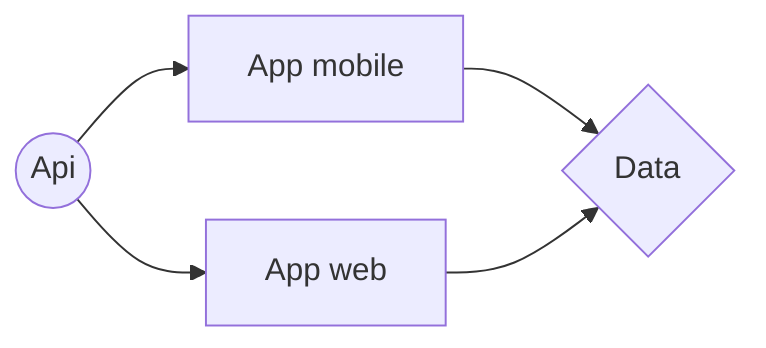
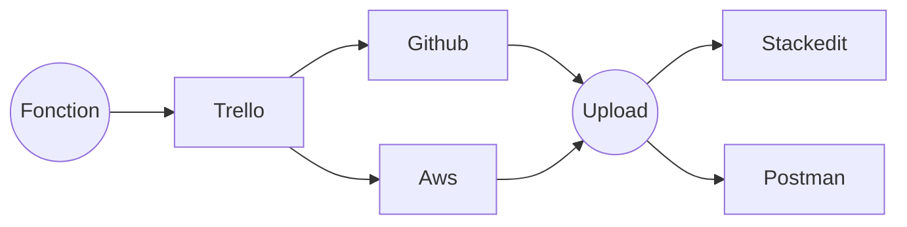
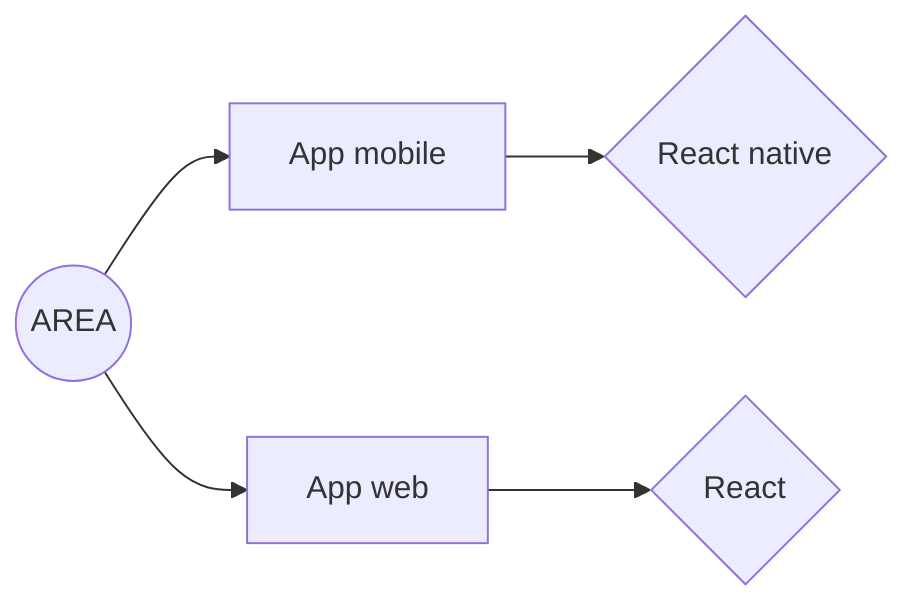
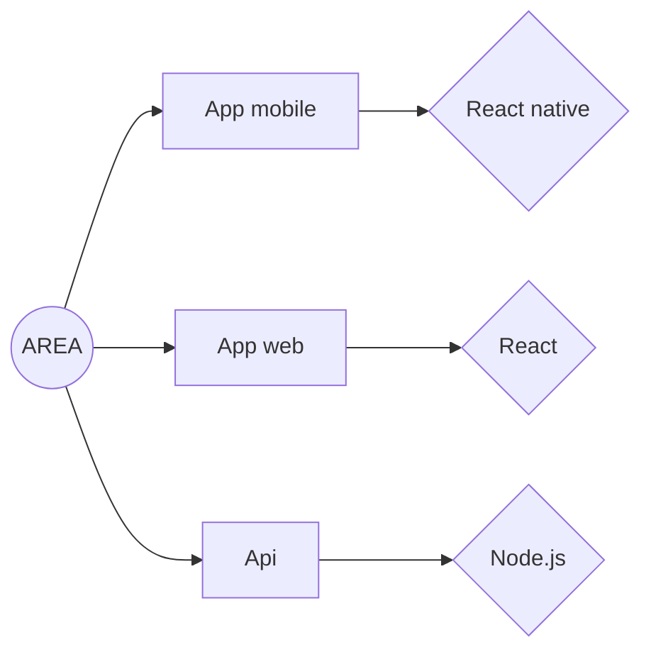
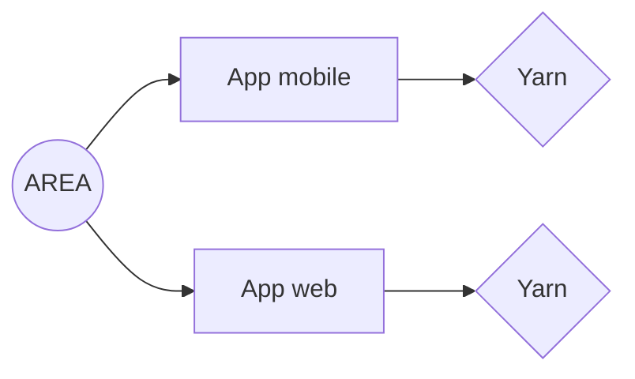
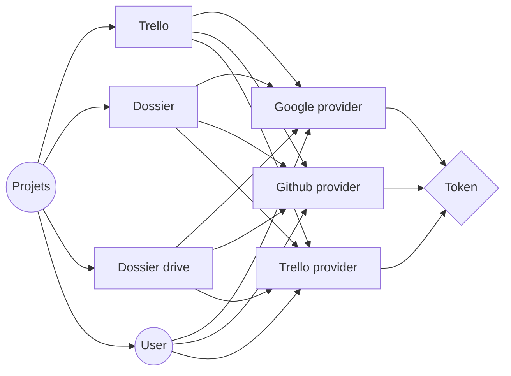

# Action REAction (AREA)
Dans le cadre de notre 3ème année l'AREA est un projet Epitech compris dans le module de développement web

## SOMMAIRE
- **Information général**
- **Environnement général**
 - **Graphique technique**

## INFORMATION GÉNÉRAL

- **Taille du groupe** : 6
- **Répertoire** : DEV_area_2018
- **Droit de ramassage** : ramassage-tek
 - **Langage** : React native, Node.js, React.js
 - **Compilation** : docker-compose build && docker-compose up

## ENVIRONNEMENT GÉNÉRAL

- **Environnement technique** :

> Application web  [link](https://7rib3.com/signin).
>  Application mobile.
> Api web [link](https://documenter.getpostman.com/view/6448473/S11DVMpa).

- **Environnement fonctionnel** :

> Management du projet [Trello](https://trello.com/b/04fAMfBU/tribe).
> Hébergement [Github](http://github.com) &  [Aws](http://github.com)
> Documentation [Stackedit](stackedit.io) & [Postman](http://github.com)

## GRAPHIQUE TECHNIQUE

### Front

### Back

### Test

## GRAPHIQUE DATABASE

# Installation
- Prérequis.
  > Docker

- Etape 1.
  > sudo docker-compose up --build

- Etape 2.
  > Lancer [AREA](http://localhost/8081)
  
